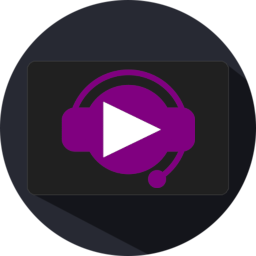

# MacroDeck.SoundPad
A SoundPad integration for Macro Deck

  

***
*This is a plugin for Macro Deck 2, it does NOT function as a standalone app*

*According to the SoundPad Remote API, you will need a full license for SoundPad, not a trial*

***
## Features

| Action | Description | Function |
| --- | --- | --- |

More features/actions coming soon...

***
## Need this in your language?
This plugin has its own localization files, independent of Macro Deck.
If your language is not available, the plugin will default to English.

Check the files available in source under [Languages](MacroDeck.SoundPad/MacroDeck.SoundPad/Languages).
If your language is missing or incomplete, please consider [helping me out by translating at POEditor](https://poeditor.com/join/project?hash=88WWuE9v4H)! 

Currently available languages:
- English
- Italian

***
## Third party licenses
This plugin makes use of:
- [Macro Deck 2 by SuchByte (Apache License 2.0)](https://macrodeck.org)
- [SoundpadConnector by Nikodem Jaworski (MIT)](https://github.com/medokin/soundpad-connector)
