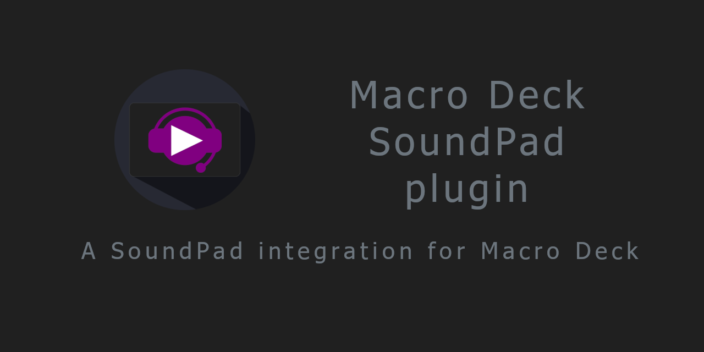

***
*This is a plugin for Macro Deck 2, it does NOT function as a standalone app*

*According to the SoundPad Remote API, you will need a full license for SoundPad, not a trial*

***
## Features

| Action | Description | Function |
| --- | --- | --- |
| Play | Simple play action | A simple fire-and-forget play action. Pressing this action again will restart the audio from the beginning. | 
| Stop | Stop playback | This will stop playback of whatever Soundpad is playing. | 
| Start Recording | Start recording from either mic or speakers | Begin recording from selected device. Actual device is selected in Soundpad preferences. | 
| Stop Recording | Stop recording | Stop recording. If you want this as a Release action after recording, you will need to create a user variable. | 

***new in v2.0.0*** \
Binding the button state to a variable! \
Variables will be generated for new buttons and you will get a prompt if you want these variables to be applied.

Please report bugs and request features. 

***
## Need this in your language?
This plugin has its own localization files, independent of Macro Deck.
If your language is not available, the plugin will default to English.

Check the files available in source under [Languages](MacroDeck.SoundPad/MacroDeck.SoundPad/Languages).
If your language is missing or incomplete, please consider [helping me out by translating at POEditor](https://poeditor.com/join/project?hash=88WWuE9v4H)! 

Currently available languages:
- English
- Italian
- German (thanks to @SuchByte)

***
## Third party licenses
This plugin makes use of:
- [Macro Deck 2 by SuchByte (Apache License 2.0)](https://macrodeck.org)
- [SoundpadConnector by Nikodem Jaworski (MIT)](https://github.com/medokin/soundpad-connector)

### Special thanks
* [Leppsoft](https://leppsoft.com/soundpad/) - The company behind Soundpad